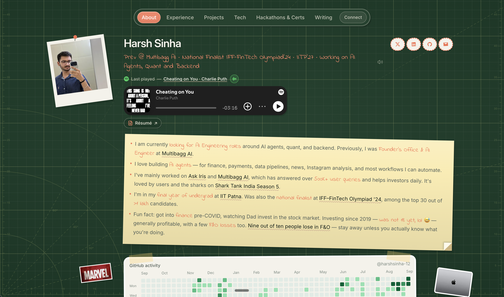

# Developer Portfolio

A fun yet functional portfolio that captures important aspects of my life in a not so boring way :)



**Live:** [harsh-portfolio-two-sigma.vercel.app](https://harsh-portfolio-two-sigma.vercel.app/)

## Features

- Cutting mat canvas with self-healing scratch marks when you drag the X-Acto knife
- Draggable stickers and cutout decor scattered across the page
- Polaroid-style hackathon cards hanging from a clothesline
- Hover-previews on links — pulls Open Graph images and favicons automatically
- Project cards with hover-to-play demo videos (tap on mobile)
- Live GitHub contribution graph rendered as a heatmap
- Floating nav with smooth scroll between sections
- Sound effects for UI interactions (toggleable, off by default on mobile)
- SEO-ready — Open Graph image, sitemap, robots, and JSON-LD person schema
- Agent-readable profile — `/llms.txt` index, `/llms-full.txt` markdown CV, `/api/about` JSON
- Fully responsive and accessible

## Tech Stack

- [Next.js 16](https://nextjs.org/) (App Router) + [React 19](https://react.dev/)
- [Tailwind CSS v4](https://tailwindcss.com/)
- [Radix UI](https://www.radix-ui.com/) for hover cards
- [PostHog](https://posthog.com/) for analytics
- [pnpm](https://pnpm.io/) (required)

## Getting Started

```bash
pnpm install
pnpm dev
```

Open [http://localhost:3000](http://localhost:3000).

## Environment

```bash
NEXT_PUBLIC_SITE_URL=https://harsh-portfolio-two-sigma.vercel.app
POSTHOG_PROJECT_TOKEN=phc_...
POSTHOG_HOST=https://us.i.posthog.com
SPOTIFY_CLIENT_ID=...
SPOTIFY_CLIENT_SECRET=...
SPOTIFY_REFRESH_TOKEN=...
REDIS_USERNAME=default
REDIS_PASSWORD=...
REDIS_HOST=...
REDIS_PORT=...
REDIS_TLS=false
```

PostHog is initialized from `instrumentation-client.ts` when
POSTHOG_PROJECT_TOKEN` is set. `POSTHOG_HOST` defaults
to `https://us.i.posthog.com`. The client enables autocapture (clicks),
pageviews/pageleaves, exception capture, web vitals, and session recordings.
In your PostHog project, turn on **Record user sessions** (and optionally
console logs) under Project settings → Session replay. The SDK stays inert
until the token is present, so you can ship the code first and add keys later.

The Spotify variables are server-only and power the live last-played line in
the profile header. Authorize the app once with the
`user-read-currently-playing user-read-recently-played` scopes, then store the
returned refresh token with the Client ID and Client Secret in your local and
deployment environment settings. Never prefix these variables with
`NEXT_PUBLIC_`.

The Redis variables power the footer visitor counter. Set `REDIS_TLS=true`
when the Redis Cloud database requires TLS. A one-year, HTTP-only cookie keeps
ordinary page refreshes from incrementing the counter repeatedly in the same
browser.

## Content

- Live data: `src/data/portfolio.ts`
- Agent-readable copies: `/llms.txt`, `/llms-full.txt`, `/api/about` (generated from `portfolio.ts`)
- Images: `public/assets/`
- Videos: `media-src/videos/` (source) → `public/assets/videos/` (optimized WebM)

## Scripts

- `pnpm dev` — development server
- `pnpm build` — production build
- `pnpm start` — serve production build
- `pnpm lint` — ESLint
- `pnpm optimize-images` — compress and convert local images to WebP
- `pnpm optimize-videos` — convert source MP4s to VP9 WebM for project cards
- `pnpm seed-link-previews` — fetch Open Graph images for link hover previews
- `pnpm generate-og` — generate the Open Graph social share image
