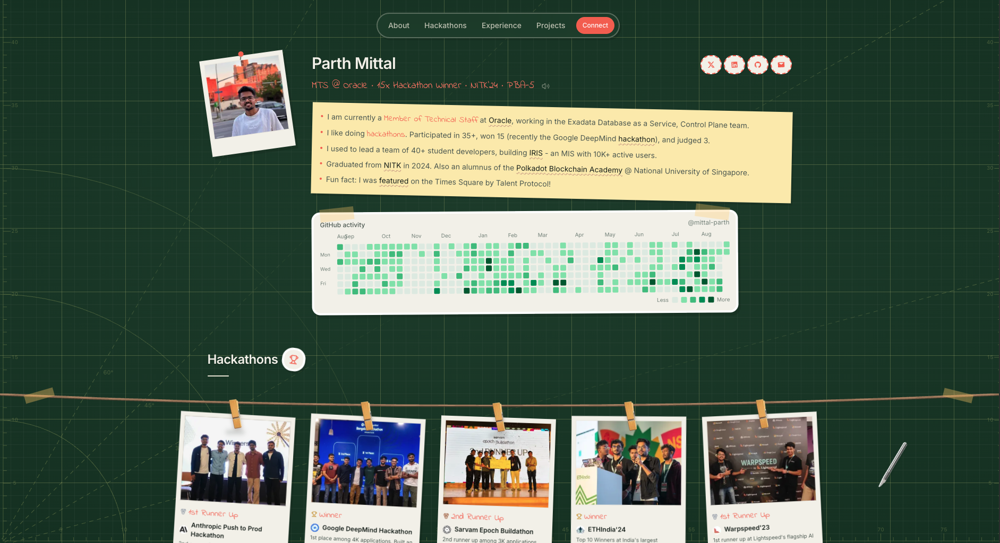

# Developer Portfolio

A fun yet function portfolio that captures important aspects of my life in a not so boring way :)



**Live:** [mittalparth.dev](https://mittalparth.dev)

## Features

- Cutting mat canvas with self-healing scratch marks when you drag the X-Acto knife
- Draggable stickers and cutout decor scattered across the page
- Polaroid-style hackathon cards hanging from a clothesline
- Hover-previews on links — pulls Open Graph images and favicons automatically
- Project cards with hover-to-play demo videos (tap on mobile)
- Live GitHub contribution graph rendered as a heatmap
- Floating nav with smooth scroll between sections
- Sound effects for UI interactions (toggleable, off by default on mobile)
- SEO-ready — Open Graph image, sitemap, robots, and JSON-LD person schema
- Fully responsive and accessible

## Tech Stack

- [Next.js 16](https://nextjs.org/) (App Router) + [React 19](https://react.dev/)
- [Tailwind CSS v4](https://tailwindcss.com/)
- [Radix UI](https://www.radix-ui.com/) for hover cards
- [PostHog](https://posthog.com/) for analytics
- [pnpm](https://pnpm.io/) (required)

## Getting Started

```bash
pnpm install
pnpm dev
```

Open [http://localhost:3000](http://localhost:3000).

## Environment

```bash
NEXT_PUBLIC_SITE_URL=https://mittalparth.dev
NEXT_PUBLIC_POSTHOG_PROJECT_TOKEN=phc_...
NEXT_PUBLIC_POSTHOG_HOST=https://us.i.posthog.com
```

## Content

- Live data: `src/data/portfolio.ts`
- Images: `public/assets/`
- Videos: `media-src/videos/` (source) → `public/assets/videos/` (optimized WebM)

## Scripts

- `pnpm dev` — development server
- `pnpm build` — production build
- `pnpm start` — serve production build
- `pnpm lint` — ESLint
- `pnpm optimize-images` — compress and convert local images to WebP
- `pnpm optimize-videos` — convert source MP4s to VP9 WebM for project cards
- `pnpm seed-link-previews` — fetch Open Graph images for link hover previews
- `pnpm generate-og` — generate the Open Graph social share image

## License

MIT
